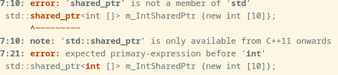

# 内存管理

## 智能指针
建议将 `unique_ptr`作为默认智能指针，当需要共享资源时才使用`shared_ptr`。
> 注意：智能指针是用来管理在堆上的内存
### 一、unique_ptr
`unique_ptr`拥有资源的所有权，当`unique_ptr`被销毁或重置时，其将自动释放所管理的资源。
#### 1.创建 unique_ptr
应当使用`make_unique(对象构造参数)`来创建智能指针:
```cpp
class Foo
{   
    bool isfoo;
public:
    Foo(const bool& _isfoo) : isfoo(_isfool) {}
    void setSmart() {isfoo = false;}
};

auto m_fooSmartPtr = std::make_unique<Foo>(true);
```
#### 2.使用智能指针
智能指针语法规则与标准指针类似，可以使用`->`或`*`来进行解引用。
```cpp
m_fooSmartPtr->setSmart();
```
可以使用`get()`方法直接获得底层指针，传递给需要的函数。
```cpp
auto originPtr = m_fooSmartPtr.get();
```
可以使用`reset()`方法释放底层指针，并将其改为另外一个指针。
```cpp
m_fooSmartPtr.reset() // 重设为nullptr
m_fooSmartPtr.reset(new Foo()) // 重设为新的Foo对象
```
由于`unique_ptr`代表对象的唯一所有权，因此其不能拷贝。对于不能拷贝的类型，可以使用移动语义`std::move()`显式移动所有权。
```cpp
auto other {m_fooSmartPtr}; // 会报错！
auto other {std::move(m_fooSmartPtr)}; // 可以使用
```

#### 3.unique_ptr和C风格数组
`unique_ptr` 适用于储存动态分配的C风格数组
```cpp
auto m_varsizearray = std::make_unique<int[]> (10);
```

#### 4.自定义 deleter
`make_unique`不支持传入自定义的deleter，需要直接构造`unique_ptr`。
```cpp
void my_deleter(int* p)
{
    delete p;
    std::cout << "resource has been free!"<<std::endl; 
}

std::unique_ptr<int, decltype(&my_deleter)> SmartIntPtr(new int{}, my_deleter);
```

### 二、shared_ptr
如果有多个对象或代码段需要同一指针的副本，建议使用`shared_ptr`。
#### 1. 创建并使用shared_ptr
同样的，建议使用 `make_shared(构造参数)`来创建智能指针
```cpp
auto m_fooSmartPtr = std::make_shared<Foo>(true);
```
从 *c++17* 开始 `shared_ptr` 也可以用于储存动态分配的c风格的数组的指针(经过尝试发现*c++11*也支持)。
```cpp
// 储存c风格数组的 shared_ptr
std::shared_ptr<int []> m_IntSharedPtr {new int [10]};
for(size_t i = 0; i < 10; ++i){
    m_IntSharedPtr[i] = i * i;
}
```
> 如果是*c++03*则会报错


从 *c++20* 开始，可以使用`make_shared()`来完成这件事，但尽管如此还是不建议使用智能指针来管理c风格动态分配数组而是使用标准库中的容器
```cpp
// 使用 make_shared 生成c风格动态数组
auto m_DoubleSharedPtr = std::make_shared<double []>(10);
```

对于 `shared_ptr` 来说自定义 deleter 要更加简单，不需要在模板参数中指定 deleter 的类型， 只需要在构造智能指针时传入 deleter 就可以。
``` c++
void close(FILE* fileptr)
{
    if(!fileptr)
        return;
    
    fclose(fileptr);
    std::cout <<"file has been closed"<<std::endl;
}

// 自定义 deleter
FILE* file {fopen("data.txt", "w")};
std::shared_ptr<FILE> m_fileptr {file, close};
if(!m_fileptr){
    std::cerr <<"file opening failed"<<std::endl;
}else{
    std::cout <<"file opened"<<std::endl;
}

```

在现代c++代码中，只有当没有涉及到所有权的问题是才允许使用原始指针！